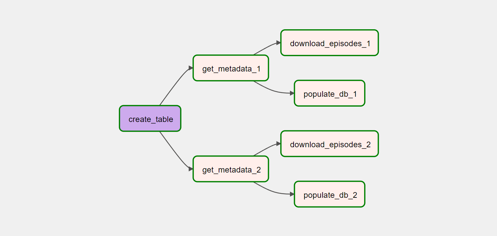

# nba-podcast-pipeline
This README contains instructions on how to setup a data pipeline using airflow which does the following:
- scrapes podcast data using an RSS feed.
- saves podcast metadata to an sqlite database.
- saves podcast audio to local directory.
  
This project is a piece of a larger project which attempts to use nba podcaster sentiment, along with nba stats, to predict the outcome of games. This larger project is coming soon. The episodes downloaded with this pipeline come from podcasts "the bill simmons podcast" and "the ringer nba show." The graph representation of the DAG resulting from this project is shown below.

## Instructions
#### initial setup
- Create a root directory for this project, and follow the instructions found [here](https://towardsdatascience.com/an-introduction-to-apache-airflow-21111bf98c1f) to install airflow within a virtual environment
- Navigate to the airflow folder resulting from the previous step, run the linux command "mkdir dags" to create a folder which will contain the pipeline
#### cloning the repo and setting up directory
- Navigate to "dags" and clone this repo. Making sure you're in the virtual environment created in step 2, run "pip install -r requirements.txt"
- Create an empty directory "episodes" within dags. This will store mp3 files downloaded by the pipeline
#### setting up sqlite3 connection
- Within your virtual environment, run "sudo apt install sqlite3" from the terminal. This will install the sqlite3 command.
- From the terminal, run "sqlite3 metadata.db", followed by ".databases" to force SQLite to create a metadata.db file. Finally, type ".quit" to exit the SQLite3 interpreter.
- Now that the database is created, run the following command to create an airflow connection to the database: "airflow connections add "podcast_metadata" --conn-type "sqlite" --conn-host "path/to/project/airflow/dags/metadata.db"
#### running with airflow
- The pipeline is now ready to be run. Simply run "airflow scheduler" and "airflow webserver" (in two separate terminals)
- To view the pipeline in the airflow gui, go to "localhost" in your browser, and find the "nba_pipeline" DAG

  For airflow commands in the above steps to work, __make sure you run "export AIRFLOW_HOME=/path/to/project-root/airflow"__.
